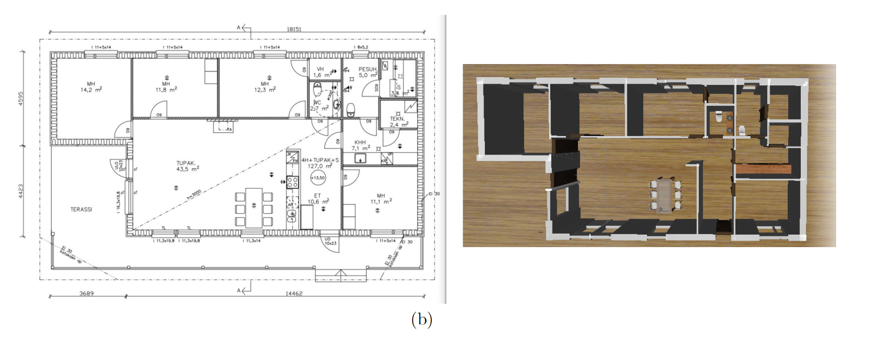
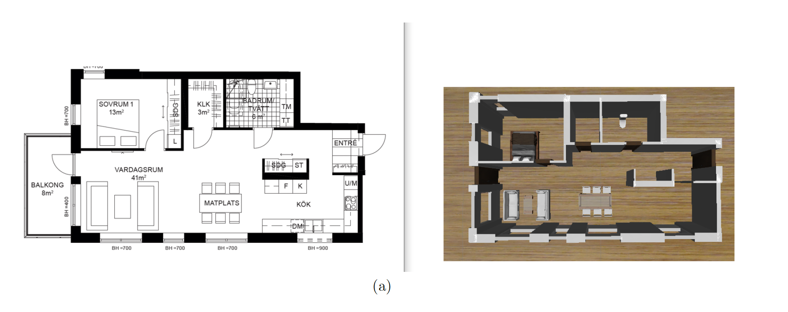
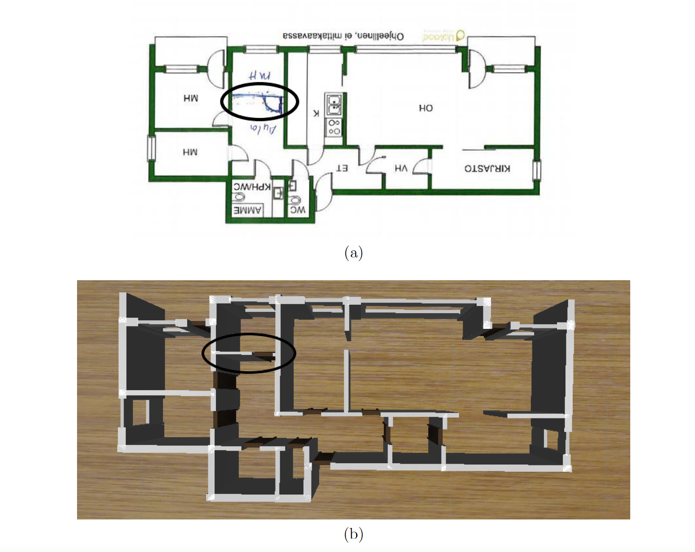
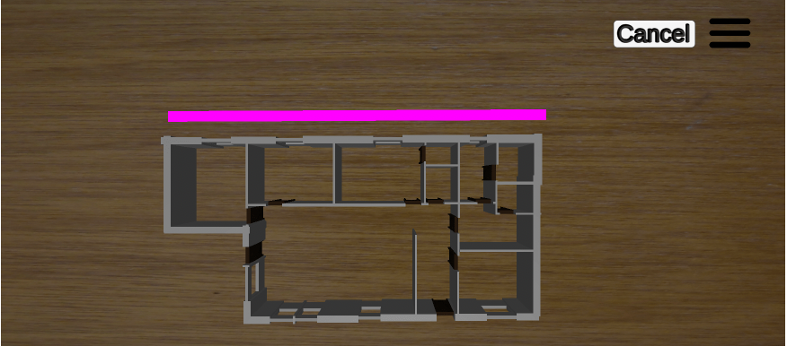
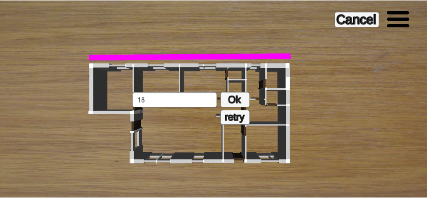
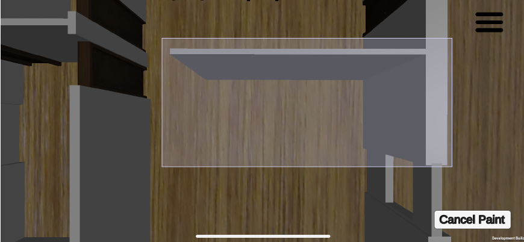
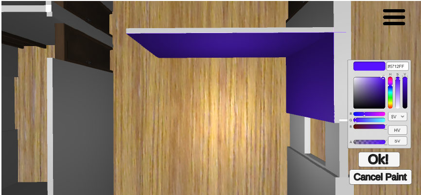
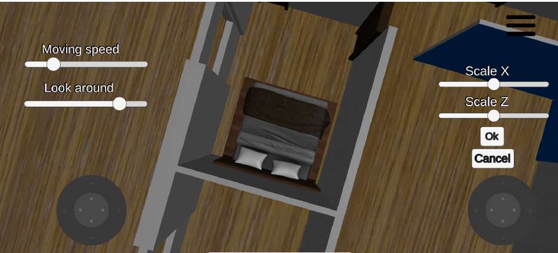

# FloorPlanTo3D: The Next Dimension in Architectural Visualization

## Introduction

FloorPlanTo3D introduces an innovative approach to transform 2D floor plan images into customizable 3D models. The process begins with users selecting a floor plan image, which is then sent to a deep learning model for analysis. Subsequently, users have the ability to customize the generated 3D scene according to their preferences.
  

FloorPlanTo3D showcases the robust capability to detect and interpret floor plans with different drawing styles, including those with hand-drawn elements.

## Project Components

FloorPlanTo3D is structured into two main parts:

1.  **Mask R-CNN Model Wrapped by REST API**: A sophisticated deep learning model that analyzes and interprets 2D floor plan images.

2.  **Unity Application**: A dynamic application that utilizes the API to construct a 3D scene from the analyzed 2D floor plan images, enabling users to customize their virtual environment.

## Installation

To set up and run the project, follow these steps:

1.  **Clone the pre-trained model and API Repo from here**: [FloorPlanTo3D-API](https://github.com/fadyazizz/FloorPlanTo3D-API).

```
git clone https://github.com/fadyazizz/FloorPlanTo3D-API
cd FloorPlanTo3D-API

```

2.  **Create and activate a new conda environment**:

```

conda create --name imageTo3D python=3.6.13

conda activate imageTo3D

```

3.  **Install dependencies**:

```


pip install -r requirements.txt

```

4.  **Download the deep learning model weights** from the following link and insert them into the `weights` folder:

[Deep Learning Model Weights](https://drive.google.com/file/d/14fDV0b_sKDg0_DkQBTyO1UaT6mHrW9es/view?usp=sharing)

5.  **Start the server**:

```

python application.py

```

These steps will prepare your environment for using the API. While the API can be accessed with any client, for a fully integrated experience, we recommend using our Unity application, located in the Unity directory (Unity engine installation required).

## Customization Features (Our Unity Client)

Users are afforded a wide range of customization options for their 3D models, including but not limited to:

- Snap an image and send to the api to be analyzed
- Modifying the scale to ensure the model matches real-world dimensions.

  <div style="display: flex; align-items: center; justify-content: space-around;">
    
    
</div>

- Changing the colors and textures of walls.
 <div style="display: flex; align-items: center; justify-content: space-around;">
    
    
</div>

- Adding furniture and selecting different styles for doors and windows.
<div style="display: flex; align-items: center; justify-content: space-around;">
   

</div>

- Have a virtual tour inside the 3D generated floor plan.

## Model Used

FloorPlanTo3D employs the Mask R-CNN model, renowned for its accuracy in object detection and instance segmentation. Our implementation is based on the Matterport version, which is specifically adapted to analyze floor plans effectively. For further details on the Mask R-CNN model, visit the [Mask R-CNN GitHub Repository](https://github.com/matterport/Mask_RCNN).

## Model Training

The model training process involved the following key steps:

- **Data set management**: Utilized a split of 80% training and 20% testing from the Cubicasa5K dataset, which contains 5000 floor plans with diverse drawing styles and is available at [Cubicasa5K Dataset](https://zenodo.org/record/2613548).

- **Model configuration**: Employed Resnet101 as the backbone, with transfer learning from the MS COCO dataset to enhance training efficiency.

- **Training**: Conducted over 15 epochs with a batch size of 1, completed in approximately 40 hours, to detect three classes of objects: walls, windows, and doors.

For an in-depth exploration of the project, refer to the bachelor's thesis available at: [Bachelor Thesis Link](https://drive.google.com/file/d/11xyyv_jUtbEp0WM-ymfffnzX45ryDV0X/view?usp=sharing).

## Author

Fady Aziz Ibrahim

Email: fady.aziz.ibrahim@gmail.com

LinkedIn: [Fady Aziz](https://www.linkedin.com/in/fady-aziz-b40687163/)
